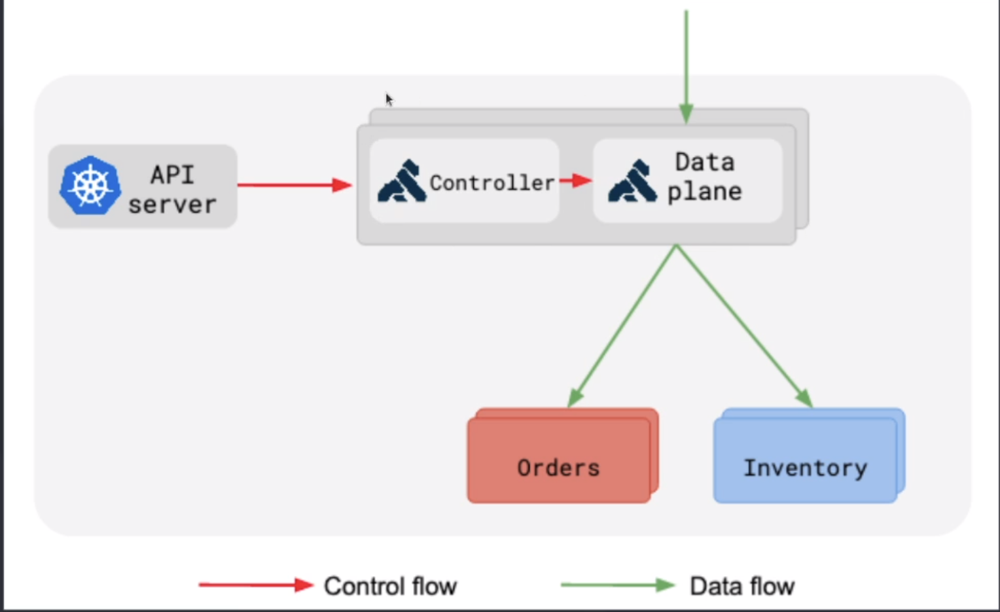

# Pre requisites

- Kind
- Kubectl
- Helm

# How it works

It follows the DB Less Kong ingress for Kubernetes

# Setup

Just run `./setup.sh` and the ingress will be available on `http://localhost:80`

# Endpoints

- '/webhook' -> dummy endpoint to test the ingress, it has the rate-limit plugin and apikey plugin configured
  - `curl --location 'http://localhost/webhook?apikey=supersecret' --data '' `
